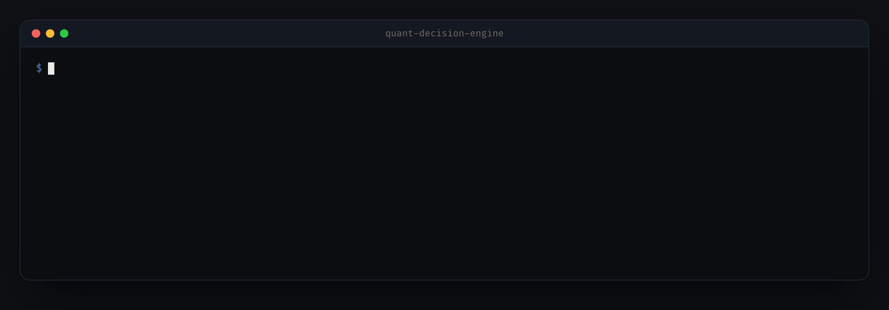
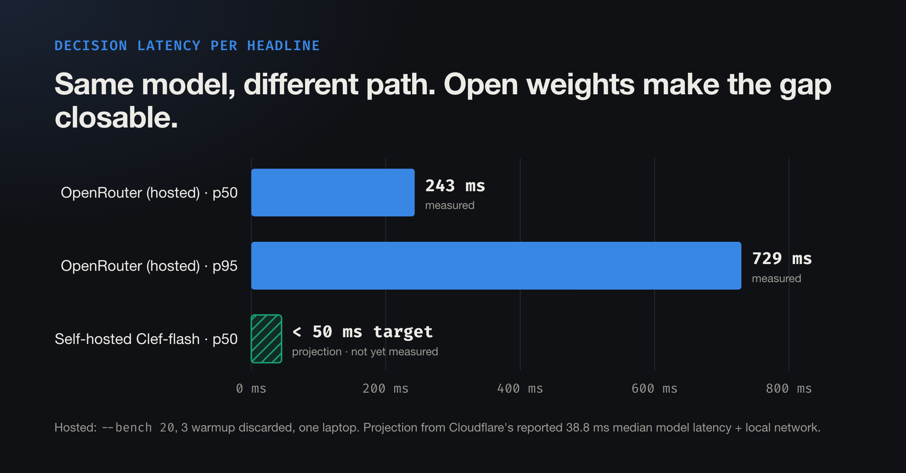
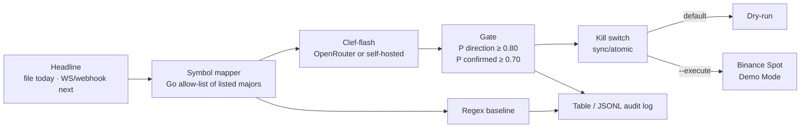

# quant-decision-engine

[](https://github.com/zinxer/quant-decision-engine/actions/workflows/ci.yml)
[](go.mod)
[](LICENSE)

**Regex reads words. Decision models read meaning.** A Go reference implementation that turns crypto news headlines
into gated trade decisions using [Cloudflare Clef-flash](https://blog.cloudflare.com/clef-decision-models/), an
open-weight *decision model* that returns typed answers with probabilities, and puts it side by side with the
keyword logic it replaces.



<sub>Replay of a real Clef-flash run via OpenRouter. Latency shown is the hosted path; see [Latency](#latency-hosted-vs-self-hosted).</sub>

> [!WARNING]
> Not financial advice. Execution is deliberately constrained: **dry-run** by default, and `--execute` sends
> orders only to Binance **Spot Demo Mode** (virtual funds). There is no production trading endpoint in the code.

## The problem

News-driven bots fail on meaning, not speed. A keyword rule sees `listing` in
**"Binance denies rumors of listing $XYZ"** and buys. Denials, questions, rumors, retractions and stale news
all contain the same words as the real event:

| Headline | Keyword rule | What actually happened |
|---|---|---|
| Binance **denies** rumors of **listing** $XYZ | BUY | nothing |
| Will Bitcoin be **banned** next week? | SELL | a question |
| **Unconfirmed**: Dogecoin could be **listed**… | BUY | a rumor |
| ETF **approval** was rejected last year | BUY | old news |

Patching the rules doesn't converge: ignore `denies` and you miss *"SEC denies spot Ethereum ETF application"*,
which is a real negative event. General-purpose LLMs read meaning but return free text, give no probability to
threshold on, and take seconds. A **decision model** takes *state* plus *typed questions* and returns bounded
answers with probabilities in one pass. → [Full argument, evidence and where regex still wins](docs/WHY-DECISION-MODELS.md)

## Results

Eight headlines, six of them written to trap keyword logic, run through both classifiers:

| | Keyword baseline | Clef-flash |
|---|---|---|
| Correct labels | **2 / 8** | **7 / 8** |

The one miss is the interesting part. *"BNB Chain hack report was a false alarm"* came back `bullish` (0.83),
but the separate `confirmed` question scored it 0.29, so the gate refused to trade. **Asking two questions gave a
second line of defence that a single keyword match can't.**

What this does **not** show: trading edge. n = 8, labels are the author's, no backtest. It demonstrates
interpretation. A known weakness found while testing: the model tends to read "bad thing didn't happen"
(*"Binance will not delist Solana"*) as bullish. Details in [limits](docs/WHY-DECISION-MODELS.md#7-where-it-is-not-better-and-what-can-go-wrong).

## Latency: hosted vs self-hosted



| Path | p50 | p95 | Status |
|---|---|---|---|
| Clef-flash via OpenRouter (laptop, `--bench 20`) | 243 ms | 729 ms | measured |
| Self-hosted Clef-flash, same host / VPC | < 50 ms target | unknown | **projection**, from Cloudflare's reported 38.8 ms median model latency |

The hosted number is the slow path on purpose: public internet, a routing layer and a provider queue. Clef's
weights are open (Apache 2.0, [`Cloudflare/clef-flash`](https://huggingface.co/Cloudflare/clef-flash)), so the
model can run next to the executor and that overhead goes away. This is meaning-aware decisioning in tens of
milliseconds, **not** HFT or MEV. Measure your own deployment with the same harness:

```bash
CLEF_URL=http://localhost:8000/v1/systemone CLEF_MODEL=clef-flash \
  go run ./cmd/qde --bench 500 --bench-warmup 20 --label "1x H100, vLLM, same host"
```

Self-hosted numbers are the most wanted contribution; see [CONTRIBUTING](CONTRIBUTING.md).

## How it works



One request per headline asks Clef two typed questions:

| Question | Type | Answers |
|---|---|---|
| `direction` | choice | bullish / bearish / none, with a probability for each |
| `confirmed` | noul | probability the headline reports an official, confirmed event |

Everything after the model answers is deterministic and small:

- **The model never picks the ticker.** Symbols come from a Go allow-list of already-listed majors. A listing
  announcement usually means the pair doesn't trade yet, so those are deliberately excluded.
- **BUY needs both** a confident direction and a confirmed event. Spot can't short, so bearish only sells a held position.
- **Kill switch** halts after a max order count or consecutive failures and stays halted. It is lock-free (`sync/atomic`) and tested under 200 concurrent callers.

→ [Architecture, process flow and test method](docs/ARCHITECTURE.md)

## Quickstart

```bash
git clone https://github.com/zinxer/quant-decision-engine && cd quant-decision-engine
go run ./cmd/qde                 # no keys needed: replays a real recorded run
```

Live, with your own key:

```bash
cp .env.example .env             # add OPENROUTER_API_KEY
make record                      # live run, rewrites data/replay/clef-flash.json
make bench                       # 200-call latency benchmark
```

<details>
<summary>All flags and environment variables</summary>

| Flag | Default | |
|---|---|---|
| `--mode` | `auto` | `live`, `replay`, or `auto` (live if a key is set, else replay) |
| `--execute` | off | send orders to Binance Spot Demo Mode |
| `--format` | `table` | `jsonl` emits one decision record per line (audit log) |
| `--color` | `auto` | `always` / `never` (`NO_COLOR` respected) |
| `--bench N` | 0 | latency benchmark over N live calls; no trading |
| `--bench-warmup` | 5 | calls discarded before measuring |
| `--label` | | name for the benchmark row |
| `--record` | off | call the live API and write the replay file |
| `--max-orders` | 3 | kill-switch order cap |
| `--delay` | 0 | pause between rows (screen recordings) |
| `--headlines`, `--replay-file` | `data/…` | input and recording paths |
| `--version` | | print the build version |

| Variable | Purpose |
|---|---|
| `OPENROUTER_API_KEY` | default model path: `cloudflare/clef-flash` via OpenRouter's Decisions API |
| `CLEF_URL`, `CLEF_MODEL`, `CLEF_API_TOKEN` | point at a self-hosted Clef or any Jev-compatible server |
| `BINANCE_DEMO_API_KEY`, `BINANCE_DEMO_API_SECRET` | Spot Demo Mode keys, only read with `--execute` |

</details>

## Engineering notes

Built to be forked by strangers, so the defaults are safe and every claim is reproducible.

- **Reproducible demo.** Real model answers, including their measured latency, are recorded and committed, so
  the demo runs offline and the numbers above can be re-derived ([ADR 0004](docs/adr/0004-replay-recordings-for-reproducible-demos.md)).
- **Safe by default.** Dry-run unless `--execute`, Demo Mode only, fixed 20 USDT notional, kill switch ([ADR 0003](docs/adr/0003-safe-by-default-execution.md)).
- **Swappable model endpoint.** OpenRouter, self-hosted Clef or Jev is a config change, not a code change ([ADR 0002](docs/adr/0002-clef-flash-hosted-for-demo-self-hosted-for-latency.md)).
- **Tested.** 50 tests under the race detector: HTTP client against stub servers (envelopes, errors, timeouts),
  gate thresholds, symbol mapping, concurrent breaker, signed Binance requests, CLI end to end (record → offline replay,
  JSONL, kill switch, cancellation). Unit-test fixtures are synthetic and labelled; only `make record` writes model data.
- **CI.** `go vet`, race tests with coverage, `golangci-lint` (incl. `gosec`, `errorlint`, `bodyclose`), `govulncheck`, and
  an offline demo run on every push; Dependabot for modules and Actions.
- **Decisions are written down.** [Architecture Decision Records](docs/adr/README.md) cover the model choice, hosting, safety and reproducibility.

```
cmd/qde/            CLI: flags, wiring, end-to-end tests
internal/decision/  Clef client, replay, regex baseline
internal/signal/    symbol mapper, gate
internal/risk/      kill switch
internal/exec/      dry-run and Binance Demo executors
internal/bench/     latency benchmark
internal/ui/        terminal table, JSONL sink
data/               headline set and recorded model answers
docs/               architecture, rationale, ADRs
```

## Roadmap

1. **Measured self-hosted numbers** to replace the projection, plus concurrent-load benchmarking.
2. **Live ingestion** (WebSocket / webhook) with de-duplication, behind the existing `Event` type.
3. **A larger labelled set** with multiple annotators and a confusion matrix; fix the relief-headline weakness with a materiality question.
4. **Backtest** against timestamped prices, with fees and slippage, before any claim of edge.
5. **Calibration check**, then probability-based position sizing.

Full list with rationale in [ARCHITECTURE.md](docs/ARCHITECTURE.md#7-future-improvements).

## Further reading

- [Why a decision model is a step up from regex](docs/WHY-DECISION-MODELS.md): evidence, the honest case for regex, risks
- [Architecture](docs/ARCHITECTURE.md): diagrams, process flow, test method, results
- [Architecture Decision Records](docs/adr/README.md)
- [Contributing](CONTRIBUTING.md) · [Security](SECURITY.md)

## License

[MIT](LICENSE) © 2026 Matthew Prag
