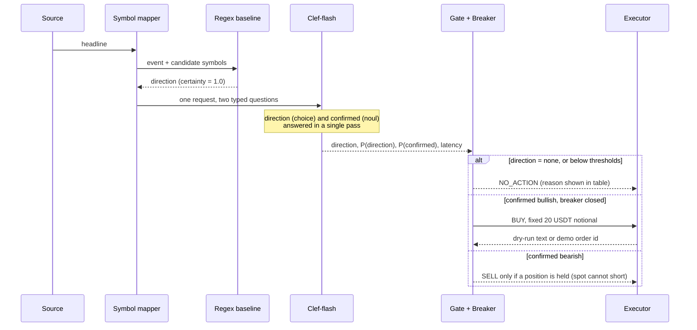

# Architecture, rationale and results

> Proof of concept. Not financial advice. Orders go only to Binance **Spot Demo Mode** (virtual funds), and only with `--execute`.

## 1. Why this exists

Headline-driven trading has always had a parsing problem. A keyword rule sees `listing` in
**"Binance denies rumors of listing $XYZ"** and buys. A general-purpose LLM reads it correctly,
but it is slow, returns free text you have to parse and repair, and gives you no probability you can threshold.

A **decision model** sits between the two. You send it *state* (the headline) and *typed questions*; it
returns typed answers (a chosen option, a probability per option, a yes/no probability) in a single pass:

| Approach | Reads meaning | Output you can trade on | Speed | Failure mode |
|---|---|---|---|---|
| Regex / keywords | no | binary match | microseconds | confidently wrong on denials, rumors, questions, stale news |
| General LLM | yes | free text to parse | seconds | schema repair, no probabilities, variable latency |
| **Decision model (Clef-flash)** | yes | `choice` + probabilities, `noul` probability | tens to hundreds of ms | needs the right context in `state`; no world knowledge |

This repo is a small, honest harness that puts the first and third rows side by side on the same headlines.
The full argument, with evidence and the cases where regex still wins, is in [WHY-DECISION-MODELS.md](WHY-DECISION-MODELS.md).

### Why Clef-flash specifically

- **Open weights (Apache 2.0).** The same model that is available as a hosted API can be run next to your
  executor. That is the whole latency story: a hosted API costs you the network and queue; self-hosting removes them.
- **Jev-compatible request shape.** The client talks to OpenRouter's Decisions API today, and a self-hosted server
  or a Jev endpoint is a one-variable change (`CLEF_URL`).
- **9B parameters.** Small enough to serve on a single GPU with room to batch.

## 2. Block diagram

Ingestion is a file today (`data/headlines.json`) behind a plain `Event` struct. Live feeds are the first item under
[future improvements](#7-future-improvements); the rest of the pipeline does not change when they land.

```mermaid
flowchart LR
    subgraph Ingest
        A[Headline source<br/>file today · WS/webhook later] --> B[Event<br/>headline + source]
    end
    B --> C[Symbol mapper<br/>"Ethereum" → ETHUSDT<br/>already-listed majors only]
    C --> D1[Regex baseline<br/>in-process]
    C --> D2[Clef-flash<br/>OpenRouter · or self-hosted]
    subgraph Decide
        D2 --> E[Verdict<br/>direction + P · P confirmed]
        E --> F[Gate<br/>P dir ≥ 0.80 · P confirmed ≥ 0.70]
    end
    F --> G[Risk breaker<br/>sync/atomic kill switch]
    G -->|default| H1[Dry-run<br/>prints the order]
    G -->|--execute| H2[Binance Spot<br/>Demo Mode]
    D1 --> I[Terminal table<br/>regex vs clef · latency]
    E --> I
    H1 --> I
    H2 --> I
```

## 3. Process flow (one headline)



The decision logic is deliberately small and fully deterministic once the model has answered:

1. **Symbols are mapped in Go, not guessed by the model.** The model never invents a ticker, and a headline that
   names zero or several symbols produces no trade.
2. **Two questions, two jobs.** `direction` says which way; `confirmed` says whether it actually happened.
   A bullish rumor can score high on direction and low on confirmed, and the gate needs both.
3. **Spot can't short.** Bearish becomes a SELL only for a symbol already held; otherwise it is a no-op.
4. **Kill switch.** `internal/risk` halts after a max number of orders or consecutive failures, and stays halted.

## 4. How it is tested

### Unit tests (`make test`, run with `-race`)

| Package | What is checked |
|---|---|
| `internal/decision` | Client against an `httptest` server: bare and `result`-wrapped responses, OpenRouter-style and Cloudflare-style errors, missing answers, unknown choices, bad JSON, auth header, request body shape, timeout |
| `internal/decision` | Regex baseline, including the headline it is expected to get wrong |
| `internal/signal` | Symbol mapper (aliases, dedup, no substring false-positives); gate thresholds, no SELL without a position, ambiguous or missing symbol |
| `internal/risk` | Max orders, consecutive-failure reset, and 200 goroutines hammering `Allow()` never exceed the limit |
| `internal/bench` | Percentile maths (nearest-rank, input not mutated, empty input), warmup excluded, failed calls counted, all-fail is an error |
| `internal/ui` | Table scoreboard, no ANSI codes when colour is off, alignment unaffected by colour, JSONL records |
| `cmd/qde` | End to end: record against a fake server then replay with the server closed, JSONL output, kill switch, cancellation, config errors, bench, `.env` loading |
| `internal/exec` | Dry-run touches nothing; Binance executor sends the right path, side, type, `quoteOrderQty`, API key header and signature to a stub server |

Fixtures in unit tests are **synthetic** and labelled as such. They test parsing and plumbing, not model quality.

### Evaluation (`make record`, `make demo`)

- **Set:** 8 headlines in `data/headlines.json`, each with an expected label (`bullish` / `bearish` / `none`).
  Six are traps for keyword logic: a denial, a question, unconfirmed speculation, stale news, a false alarm, a disputed report.
- **Method:** each headline goes through both classifiers. Accuracy is exact match against the expected label.
  Latency is wall-clock around the HTTP request and body read (`internal/decision/clef.go`), so the first call includes the TLS handshake.
- **Latency benchmark (`make bench`, `--bench N`):** N sequential live calls after a discarded warmup (connection setup, caches),
  reporting min / p50 / p95 / p99 / max / mean and a markdown row for a PR. Use `--label` to name the setup.
- **Reproducibility:** `make record` writes real responses to `data/replay/clef-flash.json`; `--mode replay`
  re-renders them offline with the original latencies, so forks run the demo with no keys.

### Limits (read before quoting any number)

- n = 8, labels are the author's judgement, and there is no backtest or PnL. This shows *interpretation*, not edge.
- One run, one laptop, one network path. Treat latency as an observation, not a benchmark.

## 5. Results

### Measured: Clef-flash via OpenRouter (recorded 2026-10-05, laptop)

| | Regex baseline | Clef-flash |
|---|---|---|
| Correct labels | 2 / 8 | 7 / 8 |
| Latency p50 | in-process | ~400 ms (demo run, n=8) · 243 ms (`--bench 20`) |
| Latency p95 | in-process | ~907 ms (demo run, max 1.4 s on the first call) · 729 ms (`--bench 20`) |

Both latency columns are tiny samples from one laptop; the bench run discards 3 warmup calls, the demo run does not.

The one miss: "BNB Chain hack report was a false alarm, team confirms no funds lost" was labelled `bullish` (0.83)
where `none` was expected. The `confirmed` question scored it 0.29, so the gate still refused to trade. That is
the point of asking two questions.

### Expected: self-hosted Clef-flash (projection, **not measured**)

The OpenRouter figure is dominated by things self-hosting removes: the public internet, OpenRouter's routing
layer, the provider's queue, and TLS setup. The projection below is an estimate built from vendor numbers,
and it is a **target to validate**, not a result.

| Stage | Measured today (OpenRouter) | Projected (self-hosted, same host or VPC) | Basis |
|---|---|---|---|
| Network to model | hundreds of ms, not separable | ~1–2 ms | same-region / loopback |
| Model inference | not separable | ~25–45 ms | Cloudflare reports 38.8 ms median, 122 ms p95 for Clef-flash on its own benchmark and prompts |
| Parse + gate + breaker | < 1 ms | < 1 ms | in-process, no allocation-heavy work |
| **Decision total** | **p50 ~400 ms / p95 ~907 ms** | **p50 target < 50 ms; p95 unknown** | |
| Order to exchange | not measured (dry-run) | not measured | depends on region and Binance endpoint |

Caveats on the projection:

- Cloudflare's own write-up describes self-hosting as `transformers` + PyTorch on an NVIDIA H200, "a research setup,
  not a one-command install". A production-style server (e.g. vLLM) with warm caches is the expected route to a
  steady sub-50 ms, but that is not demonstrated here.
- p95/p99 matter more than the median for trading. Expect GPU contention, batching and cold-start effects to
  widen the tail; this must be measured.
- The `confirmed`/`direction` prompt in this repo is larger than a bare classification, which costs prefill time.

### How to fill in the second column

Point the benchmark at your own server and open a PR with the printed row:

```bash
CLEF_URL=http://localhost:8000/v1/systemone CLEF_MODEL=clef-flash \
  go run ./cmd/qde --bench 500 --bench-warmup 20 --label "self-hosted, 1x H100, vLLM"
```

Run it on the same machine or VPC as the server, and report the hardware, serving stack and prompt length with the row.

## 6. Why it was built this way

| Decision | Reason |
|---|---|
| Decision model over an LLM | Typed answers with probabilities; no free-text parsing or schema repair; a number to threshold |
| Two questions per headline | Separates *direction* from *did it actually happen*, which is where keyword bots fail |
| Symbols mapped in Go | Deterministic and auditable; the model never invents a ticker |
| Only already-listed majors | A listing announcement usually means the pair does not trade yet; a market buy on it fails |
| Dry-run default, Demo Mode opt-in | Safe to fork and run; virtual funds only; `--execute` is explicit |
| Replay mode | The demo is reproducible offline and honest about latency because it replays real recorded numbers |
| OpenRouter for the demo | One key, no infrastructure; it is the slow path on purpose, to contrast with self-hosting |
| Go | Cheap concurrency for many feeds, one static binary. Garbage-collection pauses are not the bottleneck at these latencies; the model call is |
| Regex baseline in the same table | A decision model is only interesting next to what it replaces |

## 7. Future improvements

Roughly in order of value:

1. **Live ingestion:** WebSocket / webhook sources behind the existing `Event` struct, with de-duplication so one story is not traded twice.
2. **Published self-hosted results:** `--bench` exists; the remaining work is running it against a real self-hosted
   Clef and replacing the projection above with measured numbers (concurrent-load benchmarking is also not yet covered).
3. **Concurrency:** classify headlines through a bounded worker pool; today rows are sequential so the demo reads well on camera.
4. **Wider eval:** hundreds of labelled headlines, multiple annotators, and a confusion matrix instead of one accuracy number.
5. **Backtest:** replay timestamped headlines against price data to test whether the decisions carry any edge after fees and slippage. This repo makes no such claim.
6. **Position sizing from probabilities:** scale size with P(direction) × P(confirmed) (or a capped Kelly-style rule) instead of a fixed notional.
7. **Richer state:** inject order-book or recent-move context into `state`; the model has no world knowledge beyond what it is given.
8. **Execution latency:** a persistent order WebSocket to Binance to skip REST handshakes, and measuring the order leg end to end.
9. **Calibration check:** verify that "0.9" really means right ~90% of the time on held-out headlines before sizing on it.
10. **More question types:** `score` for magnitude ("how material is this?") alongside `choice` and `noul`.
